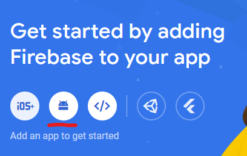

# cis3186-sso
Code to be used during SSO tutorial (to be held on 07/12/22)

# Team 2
- Adam Ruggier
- Gerard Coleiro
- Luke Chen
- Robert Mifsud

# Prerequisites
- Verify you have Node.js installed (in cmd/terminal). You can download it form [here](https://nodejs.org/en/download/).
```
node -v
# v14.15.3
npx -v
# 6.14.9
```
- Instal Expo Applicatoin Services CLI tool
```
npm install --global eas-cli
```
- Ensure you have an [Expo](https://expo.dev/signup) account. If you attended any of the react-native tutorials with Eman and used Expo Go you should have an account already.
- Install Expo Go app [IOS](https://apps.apple.com/us/app/expo-go/id982107779)/[Android](https://play.google.com/store/apps/details?id=host.exp.exponent&hl=en&gl=US). It could be the case that you might not be able to run project on the University network(eduroam), in which case we suggest you use your phone's hotspot.
# Implementation
The code required to implement this feature is fairly simple however an extensive setup process is involved. All necessary steps are outlined below.

## Project creation and initial setup

Create new expo project with blank template. You can name it 'SSO'
```
npx create-expo-app --template
```
Navigate to project directory
```
cd SSO
```
Run project, scan the qr code from your Expo Go app and verify that it works. (Ensure your laptop and phone are on the same network)
```
npx expo start
```
Install the React Native Firebase "app" module to the root of your React Native project with npm.
```
npm install --save @react-native-firebase/app
```
Install the React Native Firebase Authentication package
```
npm i @react-native-firebase/auth
```
Install expo-dev-client
```
npx expo install expo-dev-client
```
Import it in your [App.js](SSO/App.js)

`import 'expo-dev-client'`

Build **.apk**. Prompt may ask you to log-in using your Expo account. Select *Y* when prompted to create EAS project and build new keystore.

This process may take 5~10 minutes.
```
eas build --profile development --platform android
```
Install google sign-in package
```
npx expo install @react-native-google-signin/google-signin
```
After installing the package, add it as a plugin under "expo" in your [app.json](SSO/app.json) file as follows
```
{
  "expo": {
    "plugins": ["@react-native-google-signin/google-signin"],
    .
    .
    .
```

## Setting up Firebase project
- Load up [firebase.google.com](https://firebase.google.com/)
- Click on 'Get Started' and 'Create Project'. You can name your project 'SSOGoogle'
- Add firebase to an Android app


- Fetch the package name from the [app.json](SSO/app.json) file and paste it to the site.
- Get SHA-1 credentials in the terminal:
```
eas credentials
# Select default options except when asked for build credentials in which case use the down arrow and select create new build credentails
```
- Copy the SHA-1 key from the new set of credentials (**not default**) and paste to your Firebase project
- **Do not** download the google-services.json file just yet
- Click **next** and continue to your Firebase App console


- Click the gear in the top left-hand corner to open up your project settings, scroll to the bottom
- Copy the **default** SHA-1 key from the terminal and add it to your Firebase app using the **Add fingerprint** button
- Now you can go ahead and download the *google-services.json* file
- Select Build/Authentication from the side menu and select 'Get started'
- Select 'Google' toggle it on to enable it and hit **Save**

Now you can add the file in your [app.json](SSO/app.json) under expo/android as such:
```
{
  "expo": {
    .
    .
    "android": {
      "googleServicesFile": "./google-services.json",
       .
       .
       .
```
- Do not forget to paste *google-services.json* file you downloaded earlier into your project directory
- Build the project again
```
eas build --profile development --platform android
```
